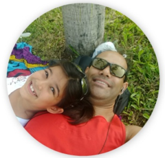

# clayton escouper das chagas

### I'm a Ph.D. Student in Computing at UFF and Professor.
### In my studies, I'm interested in understanding and mapping methodologies and techniques of software engineering and database to speed up scientific experiments
 
### Theme: A multidimensional approach to speed up the lifecycle of scientific experiments (sci ex)

 
### Interested areas in computing:
- Programming: Java, Python and R
- DevOps (CI/CD, IaaC, Conteiners)
- Refactoring
- Big Data and Data Science
- Machine Learning
- Cloud Computing

 
### Previous areas that I have some knowledge:
- Image and Video Processsing
- 3D-Models
- Antennas
- Radar and RCS
- Electromagnetic Compatibility
- Laboratory Accreditation

 
### Personal interests:
- Bicycle
- Trekking, camping and adventure
- Meditation
- Swimming
- Arduino and Raspberry Pi
- Snorkeling
- Stargazing
- Amateur photography
- Some musical instruments
- Food :-)
- G.I. Joe

 
### Previous areas of interest:
- Basketball
- Judô
- Beach volleyball
- Classic games console (SNES and PS One)
